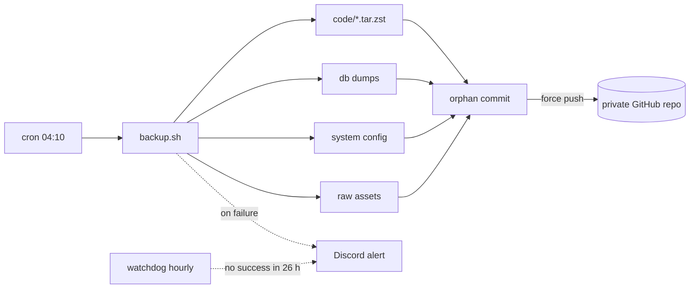

# vps-github-backup

**Daily full-server backups of a Linux VPS to a private GitHub repository, with Discord alerts.**

If the VPS is wiped, you clone one repository on a new host and follow `RESTORE.md`: applications, databases and system configuration come back.


---

## Features

- **Applications**: any list of directories, compressed with zstd (`.env` files included)
- **Databases**: consistent online dumps of PostgreSQL, MySQL/MariaDB, Redis and SQLite
- **System config**: nginx, Let's Encrypt certificates, cron, systemd units, firewall, pm2 process list
- **Large assets**: images and uploads are stored as raw files, so git deduplicates them and each file is uploaded only once
- **GitHub limits handled**: files over 100 MB are split automatically
- **One snapshot, no bloat**: each run replaces the previous snapshot, so the repository does not grow forever
- **Discord alerts**: a webhook message or a bot DM when any step fails, plus a watchdog if no backup succeeded for 26 h
- **Sanity checks**: low disk space and suspiciously small database dumps are reported
- **Restore guide** shipped inside every snapshot

## How it works



## Requirements

Linux with `bash`, `git`, `tar`, `zstd`, `python3`, `flock`. Plus the clients for the databases you back up (`sqlite3`, `pg_dumpall`, `mysqldump`, `redis-cli`).

```bash
apt install git zstd python3 sqlite3
```

## Installation

```bash
git clone https://github.com/Zodiachz/vps-github-backup.git
cd vps-github-backup
sudo ./install.sh
```

The installer copies the scripts to `/opt/vps-github-backup`, creates an SSH deploy key and adds two cron jobs (daily backup at 04:10, hourly watchdog). Then:

1. Create a **private** GitHub repository, for example `server-backup`.
2. In that repository, go to **Settings → Deploy keys → Add deploy key**, paste the key printed by the installer and tick **Allow write access**.
3. Edit `/opt/vps-github-backup/backup.conf`.
4. Test without pushing, then run for real:

```bash
sudo /opt/vps-github-backup/backup.sh --dry-run
sudo /opt/vps-github-backup/backup.sh
```

## Configuration

`backup.conf` is a bash file. Minimal example:

```bash
REPO_REMOTE="git@github.com:YOUR_USER/server-backup.git"
SSH_KEY="/root/.ssh/backup_deploy"

TAR_DIRS=("/opt/my-app" "/var/www/my-site")
RAW_DIRS=("/var/www/my-site/public/uploads")
SQLITE_DBS=("/opt/my-app/data/app.db")
POSTGRES=1
REDIS=1
PM2=1

DISCORD_WEBHOOK_URL="https://discord.com/api/webhooks/..."
```

See [`backup.conf.example`](backup.conf.example) for every option.

### Discord alerts

| Method | Settings |
|---|---|
| Channel webhook | `DISCORD_WEBHOOK_URL` |
| Direct message from your bot | `DISCORD_BOT_TOKEN` + `DISCORD_USER_IDS` (the bot must share a server with you) |

You get an alert when:

- a step fails (archive, database dump, push)
- a database dump is smaller than `MIN_DUMP_BYTES`
- free disk space is below `MIN_FREE_GB`
- no backup has succeeded for `STALE_HOURS` (watchdog)

Successful runs stay silent.

## Snapshot layout

```
code/      application directories (.tar.zst), named after their path: /opt/my-app -> opt_my-app.tar.zst
db/        database dumps (.zst)
system/    etc.tar.zst, crontab, pm2 list, firewall rules, package list
assets/    raw large folders, named the same way
RESTORE.md step-by-step restore guide
SNAPSHOT.txt  date, host and size
```

## Restore

Clone the backup repository on the new server and follow [`RESTORE.md`](RESTORE.md).

## Security notes

- The backup contains your secrets (`.env` files, database contents, TLS keys). **Keep the repository private** and enable two-factor authentication on your GitHub account.
- Use a **deploy key**: it can only access that one repository, not your whole account.
- `backup.conf` holds your Discord token/webhook. It is created with `chmod 600` and ignored by git.

## Limits

- GitHub recommends repositories under 5 GB. Exclude replays, logs and build artifacts.
- A single push is limited to 2 GB. If your first snapshot is bigger, start with fewer `RAW_DIRS` and add them over the next runs (unchanged files are not uploaded again).
- The staging folder is wiped on every run. The script refuses system folders and any non-empty folder it did not create.
- Only the latest snapshot is kept. For history, run a second copy of the tool to another repository weekly.

## License

[MIT](LICENSE)
